# 3HAG Strategic Tools Reference

Quick reference for all strategic tools used in the 3HAG framework.

## Table of Contents

1. [Gut It Out Canvas](#gut-it-out-canvas)
2. [Core Customer Profile](#core-customer-profile)
3. [Market Map (Porter's Five Forces)](#market-map)
4. [Attribution Framework](#attribution-framework)
5. [Activity Fit Map](#activity-fit-map)
6. [Swimlanes](#swimlanes)
7. [36-Month Rolling Forecast](#36-month-rolling-forecast)
8. [One Phrase Strategy Worksheet](#one-phrase-strategy-worksheet)

---

## Gut It Out Canvas

**When to use**: Step 1 — Initial 3HAG creation with leadership team.

```markdown
# 3HAG Gut It Out Canvas

## Company: _______________
## 3HAG End Date: _______________

### Individual Estimates (fill privately, then share)

| Leader | Cash in Bank | Revenue | Widgets |
|--------|-------------|---------|---------|
|        | $           | $       |         |
|        | $           | $       |         |
|        | $           | $       |         |
|        | $           | $       |         |

### Consensus Targets

| Metric | Target |
|--------|--------|
| Cash in Bank | $ |
| Revenue | $ |
| Widgets (Profit/X: ______) | |

### 3HAG Statement (describe year 3 WITHOUT numbers)

> In 3 years, we will be...
>
> _____________________________________________
> _____________________________________________
```

---

## Core Customer Profile

**When to use**: Step 4 — Define ideal customer before strategy work.

```markdown
# Core Customer Profile

## Demographics

| Attribute | Profile |
|-----------|---------|
| Role/Title | |
| Company Size | |
| Industry | |
| Geography | |
| Current Solution | |

## Psychographics

### Primary Pain (in their words)
> "_____________________________________________"

### Secondary Pains
1.
2.
3.

### Trigger Events (what causes them to buy)
1.
2.
3.

### What They Value Most
1.
2.
3.

### Decision Criteria (how they evaluate options)
1.
2.
3.

## Economics

| Metric | Value |
|--------|-------|
| Annual spend on this problem | $ |
| Expected lifetime value | $ |
| Acceptable acquisition cost | $ |
| Decision timeline | |

## Validation Status

- [ ] Hypothesis only
- [ ] Validated with 5+ discovery calls
- [ ] Confirmed with paying customers
```

---

## Market Map

**When to use**: Step 3 — Visualize competitive landscape.

```markdown
# Market Map (Porter's Five Forces)

## Company: _______________


### New Entrants (Threat of new players)
1.
2.
3.

### Suppliers (Their power)
1.
2.
3.

### Competitors (Rivalry)
1.
2.
3.

### Customers (Their power)
1.
2.
3.

### Substitutes (Alternative solutions)
1.
2.
3.

## White Space Identified

Where competitors are NOT focusing:
1.
2.
3.

Unmet customer needs:
1.
2.
3.

## Our Differentiated Niche

> _____________________________________________
```

---

## Attribution Framework

**When to use**: Step 5 — Find competitive white space through attribute analysis.

```markdown
# Attribution Framework

## Company: _______________
## Core Customer: _______________

### Attribute Analysis

| Attribute | Importance to Customer (1-5) | Your Delivery (1-5) | Competitor A (1-5) | Competitor B (1-5) | Competitor C (1-5) | Gap/Opportunity |
|-----------|------------------------------|---------------------|--------------------|--------------------|--------------------|-----------------|
| | | | | | | |
| | | | | | | |
| | | | | | | |
| | | | | | | |
| | | | | | | |
| | | | | | | |
| | | | | | | |
| | | | | | | |

### Scoring Guide
- **Importance**: 5 = Critical, must have | 1 = Nice to have
- **Delivery**: 5 = Best in market | 1 = Not offered

### White Space Summary

High importance (4-5) + Low market delivery (≤2):

1. **Attribute**: _____________ | Importance: ___ | Market avg: ___
2. **Attribute**: _____________ | Importance: ___ | Market avg: ___
3. **Attribute**: _____________ | Importance: ___ | Market avg: ___

### Strategic Implication

We should focus on owning:
1.
2.
3.
```

---

## Activity Fit Map

**When to use**: Steps 6 & 8 — Map differentiating activities and supporting activities.

```markdown
# Activity Fit Map

## Company: _______________

## Level 1: Core Differentiators

```mermaid
flowchart TB
    OPS["🎯 ONE PHRASE STRATEGY<br/><i>'_______________'</i>"]

    OPS --> D1
    OPS --> D2
    OPS --> D3
    OPS --> D4
    OPS --> D5

    D1["Differentiator #1<br/>_______________"]
    D2["Differentiator #2<br/>_______________"]
    D3["Differentiator #3<br/>_______________"]
    D4["Differentiator #4<br/>_______________"]
    D5["Differentiator #5<br/>_______________"]

    D1 <--> D2
    D2 <--> D3
    D1 <--> D4
    D3 <--> D5
    D4 <--> D5
    D2 <--> D4
    D2 <--> D5
```



*The bidirectional arrows show "fit" — activities that reinforce each other.*

## Level 2: Supporting Activities

### Differentiator #1: _______________________

Supporting activities required:
1.
2.
3.
4.

### Differentiator #2: _______________________

Supporting activities required:
1.
2.
3.
4.

### Differentiator #3: _______________________

Supporting activities required:
1.
2.
3.
4.

### Differentiator #4: _______________________

Supporting activities required:
1.
2.
3.
4.

### Differentiator #5: _______________________

Supporting activities required:
1.
2.
3.
4.

## Fit Test

Do activities reinforce each other? (Y/N)
- D1 ↔ D2:
- D1 ↔ D3:
- D1 ↔ D4:
- D1 ↔ D5:
- D2 ↔ D3:
- D2 ↔ D4:
- D2 ↔ D5:
- D3 ↔ D4:
- D3 ↔ D5:
- D4 ↔ D5:

Would a competitor need to copy ALL activities to compete? [ ] Yes [ ] No
```

---

## Swimlanes

**When to use**: Step 9 — Map 12-quarter execution roadmap.

```markdown
# Swimlanes: 12-Quarter Roadmap

## Company: _______________
## 3HAG: _______________

|              | Q1 | Q2 | Q3 | Q4 | Q5 | Q6 | Q7 | Q8 | Q9 | Q10 | Q11 | Q12 |
|--------------|----|----|----|----|----|----|----|----|----|----|-----|-----|
| **Diff #1:** |    |    |    |    |    |    |    |    |    |    |     |     |
| [Name]       |    |    |    |    |    |    |    |    |    |    |     |     |
| **Diff #2:** |    |    |    |    |    |    |    |    |    |    |     |     |
| [Name]       |    |    |    |    |    |    |    |    |    |    |     |     |
| **Diff #3:** |    |    |    |    |    |    |    |    |    |    |     |     |
| [Name]       |    |    |    |    |    |    |    |    |    |    |     |     |
| **Diff #4:** |    |    |    |    |    |    |    |    |    |    |     |     |
| [Name]       |    |    |    |    |    |    |    |    |    |    |     |     |
| **Diff #5:** |    |    |    |    |    |    |    |    |    |    |     |     |
| [Name]       |    |    |    |    |    |    |    |    |    |    |     |     |

### Milestone Legend

Each cell contains: Milestone description

### Year 1 Milestones (Q1-Q4)

**Diff #1**:
- Q__:
- Q__:

**Diff #2**:
- Q__:
- Q__:

**Diff #3**:
- Q__:
- Q__:

**Diff #4**:
- Q__:
- Q__:

**Diff #5**:
- Q__:
- Q__:

### Year 2 Milestones (Q5-Q8)

[Same structure]

### Year 3 Milestones (Q9-Q12)

[Same structure]

### Dependency Check

Are there conflicts where multiple differentiators need same resources?
-
-

### Resource Alignment

Do we have/can we acquire resources for all Year 1 milestones?
- [ ] Yes
- [ ] No — gaps: _______________
```

---

## 36-Month Rolling Forecast

**When to use**: Step 10 — Financial projections tied to strategy.

```markdown
# 36-Month Rolling Forecast

## Company: _______________
## Created: _______________
## Last Updated: _______________

### Annual Summary

| Year | Revenue | Widgets | Cash (EOY) | Team Size |
|------|---------|---------|------------|-----------|
| Y1   | $       |         | $          |           |
| Y2   | $       |         | $          |           |
| Y3   | $       |         | $          |           |

### Year 1 Monthly Detail

| Month | Revenue | Widgets | Cash | Key Assumptions |
|-------|---------|---------|------|-----------------|
| M1    | $       |         | $    |                 |
| M2    | $       |         | $    |                 |
| M3    | $       |         | $    |                 |
| M4    | $       |         | $    |                 |
| M5    | $       |         | $    |                 |
| M6    | $       |         | $    |                 |
| M7    | $       |         | $    |                 |
| M8    | $       |         | $    |                 |
| M9    | $       |         | $    |                 |
| M10   | $       |         | $    |                 |
| M11   | $       |         | $    |                 |
| M12   | $       |         | $    |                 |

### Year 2 Monthly Detail

[Same structure]

### Year 3 Monthly Detail

[Same structure]

### Key Assumptions

1.
2.
3.
4.
5.

### Risks to Forecast

| Risk | Impact | Likelihood | Mitigation |
|------|--------|------------|------------|
|      |        |            |            |
|      |        |            |            |
|      |        |            |            |
```

---

## One Phrase Strategy Worksheet

**When to use**: Step 7 — Distill strategy into memorable phrase.

```markdown
# One Phrase Strategy Worksheet

## Company: _______________

### Input Review

**Our 5 Differentiators:**
1.
2.
3.
4.
5.

**Our Core Customer:**
>

**Our White Space:**
>

### Brainstorm (generate 10+ options)

1.
2.
3.
4.
5.
6.
7.
8.
9.
10.

### Evaluation Criteria

| Candidate | Memorable (1-5) | Captures Position (1-5) | Guides Decisions (1-5) | Total |
|-----------|-----------------|-------------------------|------------------------|-------|
|           |                 |                         |                        |       |
|           |                 |                         |                        |       |
|           |                 |                         |                        |       |

### Tests

**Selected Phrase**: "_______________________"

- [ ] Can a new employee explain it?
- [ ] Would customers recognize it?
- [ ] Does it guide daily decisions?
- [ ] Is it different from competitors?
- [ ] Is it 3-8 words?

### Famous Examples for Inspiration

| Company | One Phrase Strategy |
|---------|---------------------|
| Southwest | Short-haul, low-cost, point-to-point |
| IKEA | Low-price, stylish, self-serve furniture |
| Enterprise | We'll pick you up |
| Walmart | Everyday low prices |
| Volvo | Safety |
```
